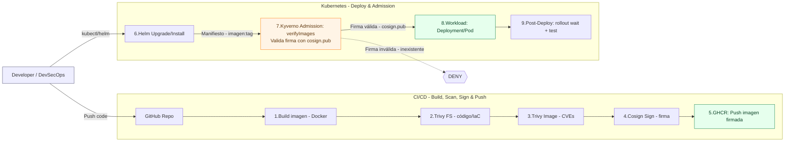
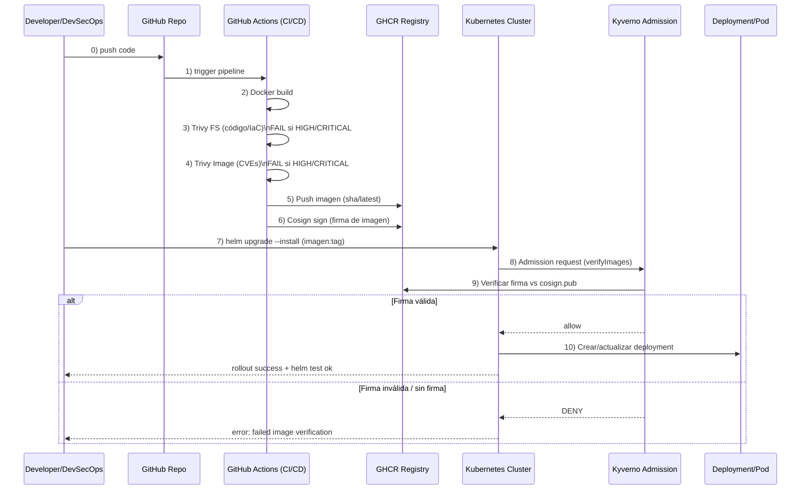

📌 Proyecto – container-security-signed

🎯 Objetivo

Imagen Docker mínima, no-root (distroless).

Firmar la imagen con Cosign (clave propia).

Verificar/enforce firma en Kubernetes con Kyverno (solo pasa si la firma coincide con tu clave).

---

🏗 Arquitectura

🎬 Diagrama de Secuencia

